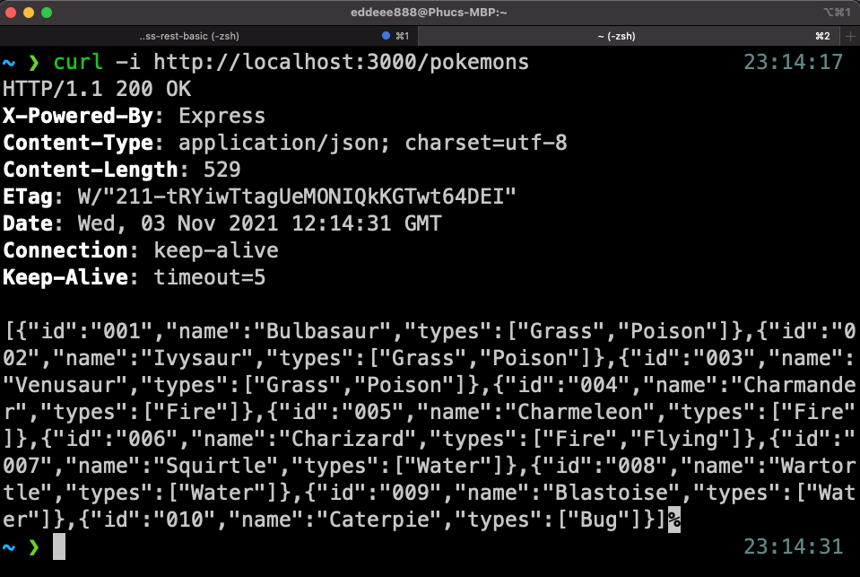
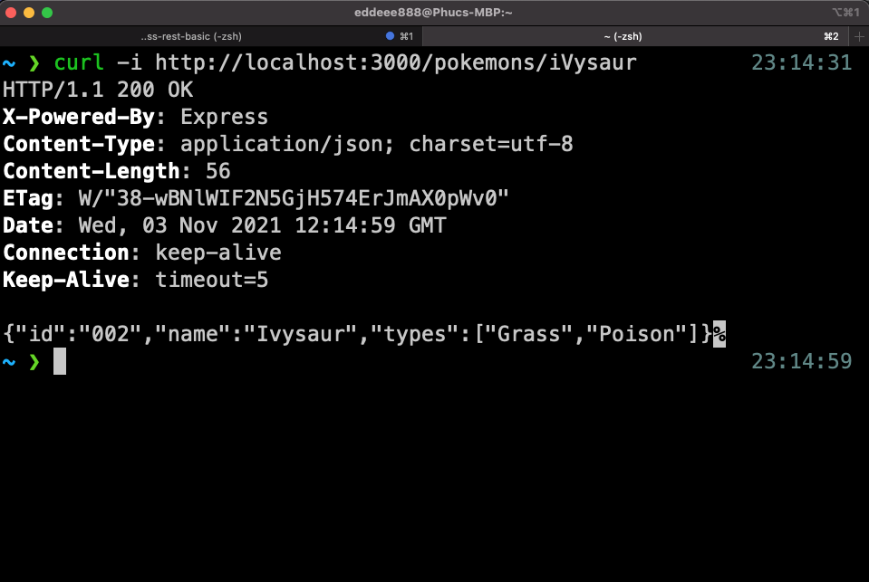
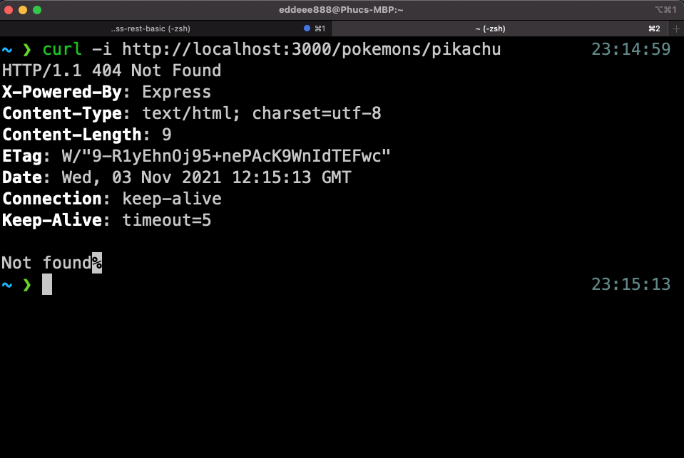

# Exercise - Node.js Express API

In this exercise, we will be creating a simple [Express](https://expressjs.com/) server that:

- Run on `http://localhost:3000`
- Returns all Pokemons data as JSON at `http://localhost:3000/pokemons`
- Returns one Pokemon data as JSON based on their name `http://localhost:3000/pokemons/<name>`. If no Pokemon data is found, return `Not Found`
- Make sure all our requests return the right [HTTP response status code](https://developer.mozilla.org/en-US/docs/Web/HTTP/Status)

## Getting Started

1. Make sure you have Node and NPM installed:

```bash
$ node -v
v14.17.6 # Example

$ npm -v
6.14.15 # Example
```

2. Fork this repo by clicking the "Fork" button in GitHub UI

3. Clone the forked repo

```
$ git clone git@github.com:YOUR_GITHUB_USERNAME_HERE/exercise-node-express-rest-basic.git
```

## Exercise

1. Install Express. [Documentation](https://expressjs.com/en/starter/installing.html)

2. Run the Express server at `http://localhost:3000`

3. Make the server returns all data from [data.json](./data.json) when a GET request hits `http://localhost:3000/pokemons`. Use the correct HTTP status code.

4. Make the server returns the Pokemon data as JSON if their name is passed in `http://localhost:3000/pokemons/<pokemon-name>`. If no Pokemon found, return correct HTTP status code and `Not Found` string as response body.

Note1: After every change, you may need to restart the Express server to see changes

Note2: To test your server response, you can use [curl](https://curl.se/) in the Terminal or [Insomnia](https://insomnia.rest/)/[Postman](https://www.postman.com/) if you prefer apps.

## Examples

1. `http://localhost:3000/pokemons`



2. `http://localhost:3000/pokemons/<name>` - Success



3. `http://localhost:3000/pokemons/<name>` - Not found



## Resources

- HTTP response status codes: https://developer.mozilla.org/en-US/docs/Web/HTTP/Status
- Express: https://expressjs.com/
- HTTP Methods: https://www.w3schools.com/tags/ref_httpmethods.asp
- REST API concepts and examples: https://www.youtube.com/watch?v=7YcW25PHnAA
